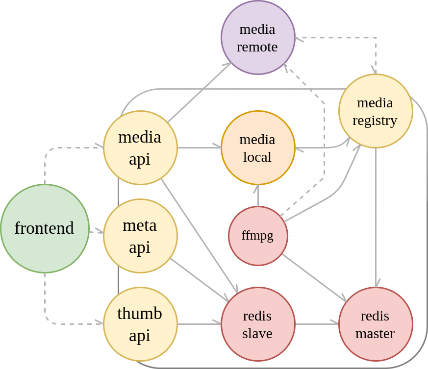

# PYMP - Python Media Player

DIWHY Media Player  - A microservice experiment.

- App written in Python, using Flask.
- Observability provided by prometheus.
- Load tests provided by locust.

---

## Build:

``` sh
cd dev
./build-all.sh
sudo mkdir -p /srv/media/videos
sudo mkdir -p /srv/media/redis
sudo chown -R $USER:docker /srv/media
```


## Basic Example:

``` sh
cd examples/basic
docker-compose up -d
```
Running the docker-compose file in 'example/basic':
- frontend: localhost:8080
- server: localhost:8081
- file_svc: localhost:8087
- redis: internal (rw)

## Microservice Example:

``` sh
cd examples/multiple_frontend
docker-compose up -d
```
Running the docker-compose file included in 'example/multiple_frontend':

App Services
- frontend: localhost:8080
- media-api: localhost:8081
- meta-api: localhost:8082
- thumb-api: localhost:8083
- file: localhost:8087
- media-remote: localhost:8880
- media-local: internal
- ffmpeg: internal
- redis-master: internal (rw)
- redis-slave: internal (ro)

Monitoring Services
- prometheus: localhost:9090
- locust: localhost:8089


 
## Upload:

``` sh
for file in *; do
    echo $file
    if [ -f "$file" ]; then
        curl -i -X POST -H "Content-Type: multipart/form-data" -F "file=@$file" localhost:8087/upload
    fi
done
```
